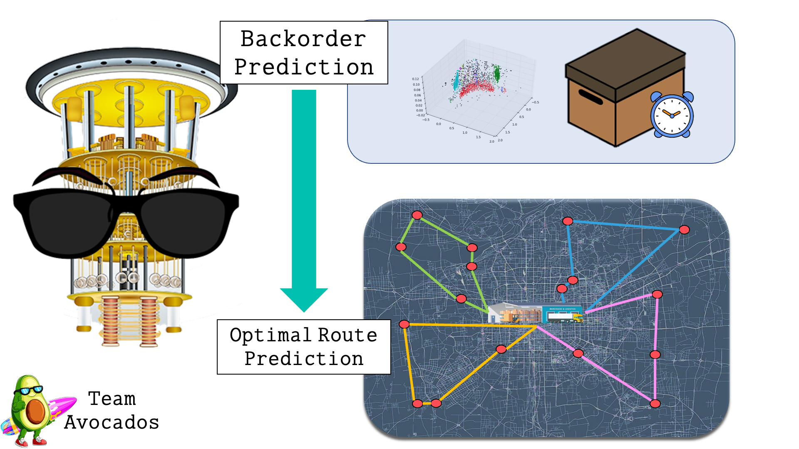
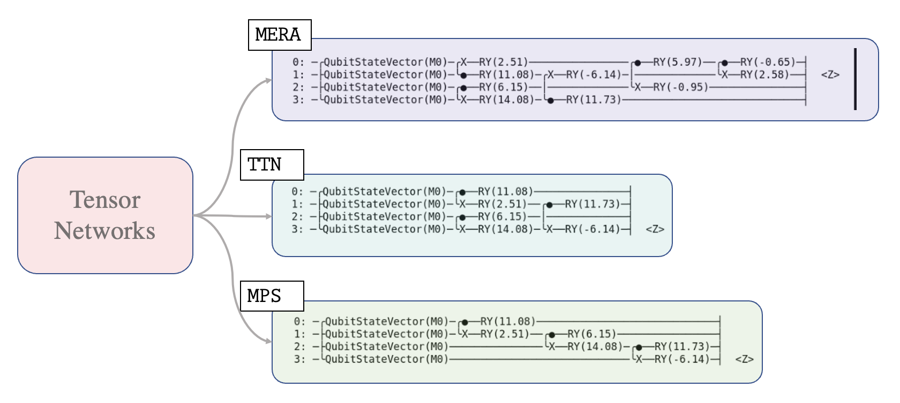
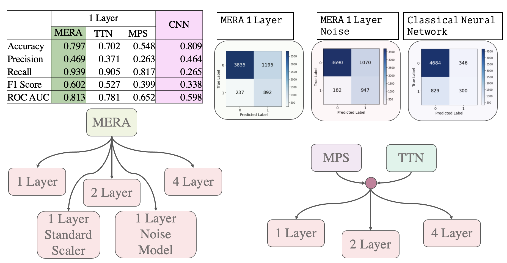
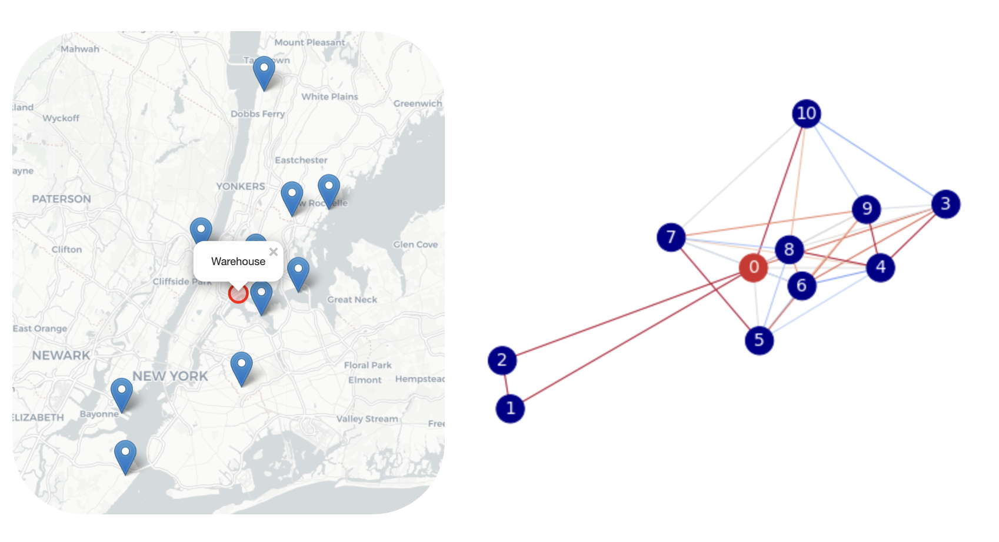
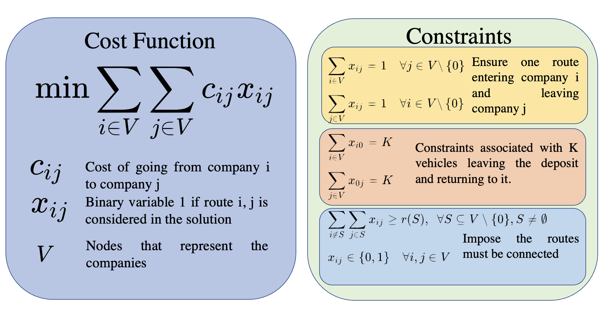
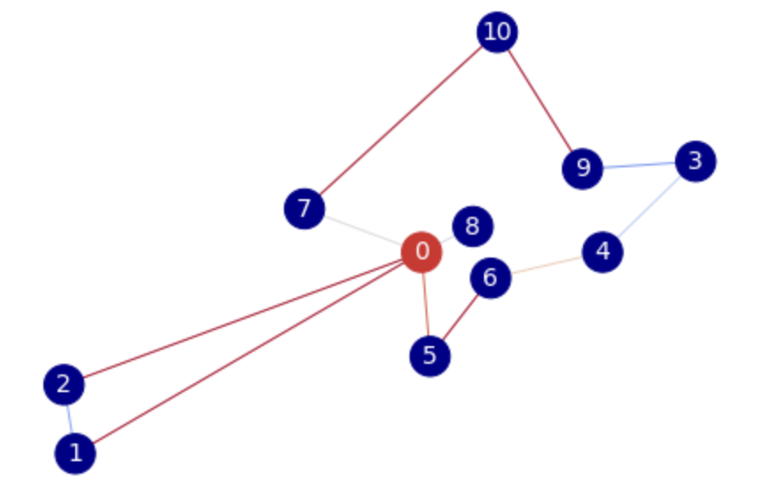
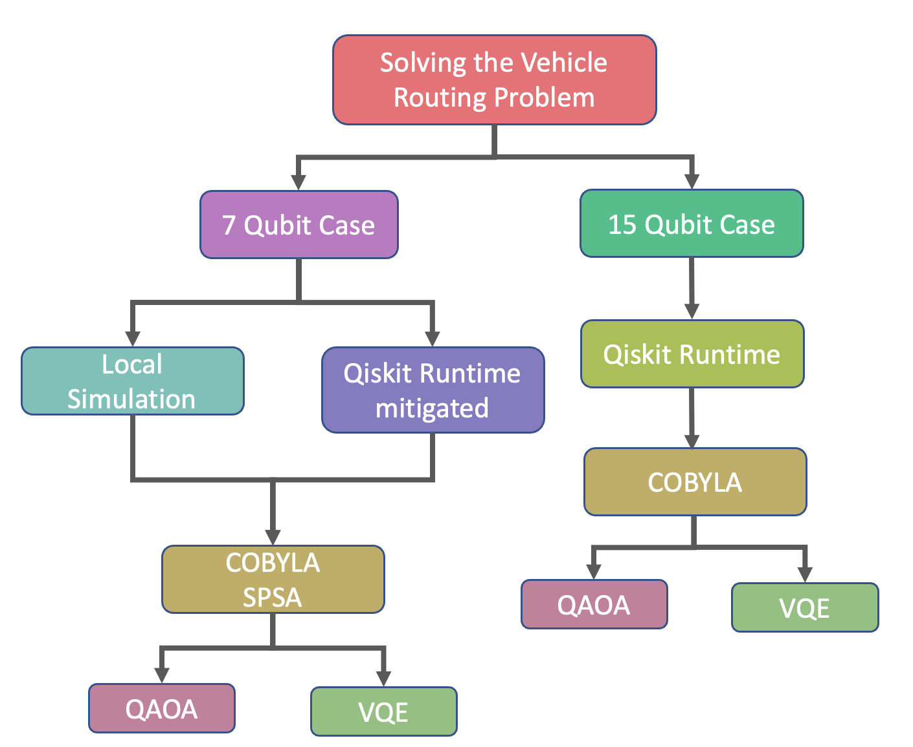
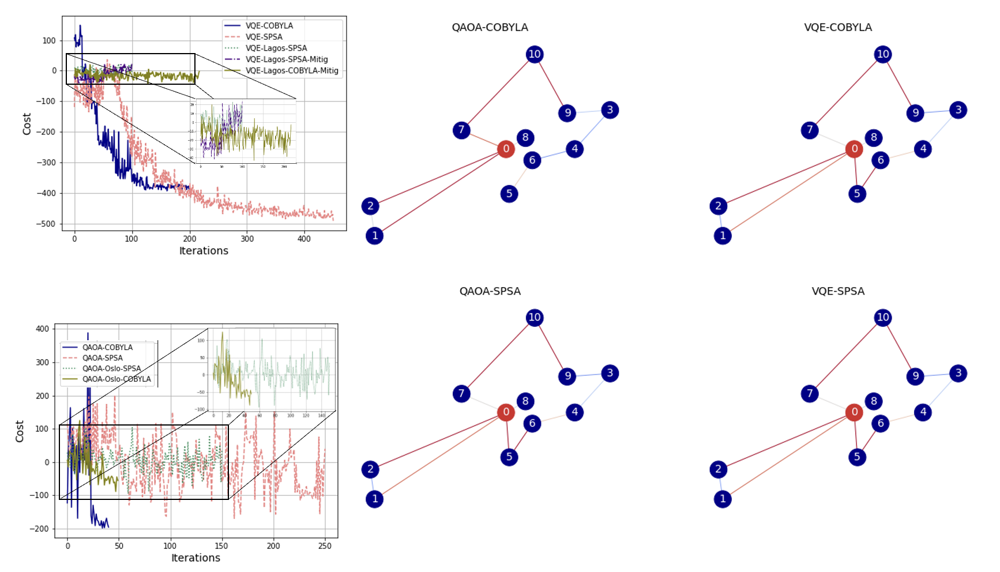
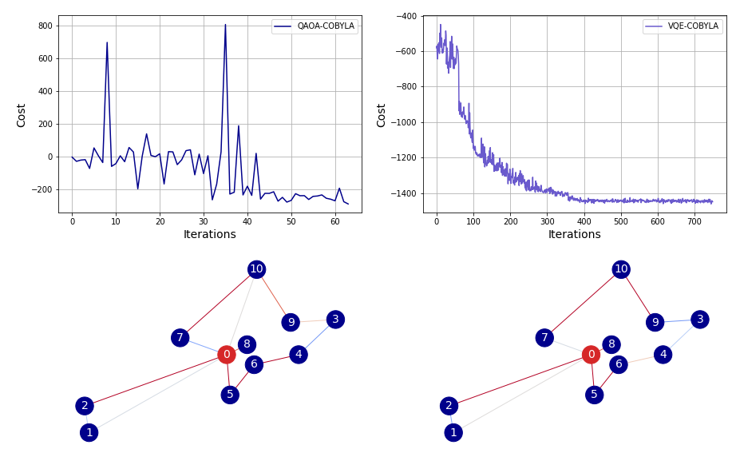

# Quantum Supply Chain Manager

The quantum supply chain manager is a quantum solution for logistics problems. We use the power of quantum machine learning for product [backorder](https://www.investopedia.com/terms/b/backorder.asp) prediction and quantum optimization for finding the best route to pick those products with high demand to store them in strategic warehouses. With the first technique, our clients can be prepared for increasing the production of their products when they are in high demand. Once we have established a set of products needed during a period of time, we use our second solution, the vehicle routing problem (VRP) solution to find the optimal route for picking these products. This reduces considerably costs associated with logistics, transportation, backorders, and overstocking for our clients. In summary, these solutions will improve business in terms of client satisfaction, backorder and shipping transportation costs.

### But, why this is important?

Mainly, backorders indicate that the demand for a specific product was not well understood at a certain point in time and needs to be reevaluated. This has a high impact on the customers' loyalty and the company revenue. The solution to this problem must be increasing the production of the products with a high probability of backorder before that happen avoiding overstocking them which may result in high inventory costs. Using quantum neural networks (QNN), we can improve the predictability, the training size, and the number of variables for the backorder predictions.

On the other hand, the VRP finds optimal solutions for picking products in terms of costs and time. The benefit of finding an optimal solution can represent a saving of up to 30% of the costs associated with transportation [1]. However, current techniques deal with up to 400 variables in a reasonable time. Soon with a growing e-market, the capabilities of such models will be overcome. In the near future, we will need systems able to solve thousands of variables in small periods of time. 

### Is this something that we cannot do with classical computation?

The short answer is "depends", we can rely on the power of classical computation and heuristic methods to solve such a problem at **small scale**. At this moment, classical algorithms have the capacity of working with hundreds of variables to solve the VRP in a couple of minutes with a good quality compared with the best-known solutions (BKS) [2]. This means in small scenarios, this is a viable solution. However, as the e-market is expanding worldwide the requirement will be that of solving thousands of variables with good quality and in a reasonable time. The increment in variables number has a tendency to increase exponentially the time required to solve these problems on classical computers. This is an aspect that quantum computers can overcome, encoding large problems in a reasonable time and solving them much faster with quantum algorithms such as the quantum approximate optimization algorithm (QAOA).

We foresee a future where quantum computers will reduce largely the costs associated with storage and transportation at a big scale thanks to the combination of forecasting backorders and route optimization.

## Proof of Concept

To show the applicability of our concept, we have used real data of some products in the [dataset backorder](https://github.com/akhiilkasare/Back-Order-Prediction-iNeuron). The dataset contains 23 variables including:

|     |     |     | | | |
| --- | --- | --- | - | - | - |
| **sku** Product ID | **national_inv** Current inventory level for the part |**lead_time** Transit time for product | **in_transit_qty** Amount of product in transit from source|**forecast_3_month** Forecast sales for the next 3 months | **forecast_6_month** Forecast sales for the next 6 months|
|**forecast_9_month** Forecast sales for the next 9 months|**sales_1_month** Sales quantity for the prior 1 month time period|**sales_3_month** Sales quantity for the prior 3 month time period |**sales_6_month** Sales quantity for the prior 6 month time period |**sales_9_month** Sales quantity for the prior 9 month time period |**min_bank** Minimum recommend amount to stock 
|**potential_issue** Source issue for part identified |**pieces_past_due** Parts overdue from source |**perf_6_month_avg** Source performance for prior 6 month period |**perf_12_month_avg** Source performance for prior 12 month period |**local_bo_qty** Amount of stock orders overdue|**deck_risk** Part risk flag
|**oe_constraint** Part risk flag | **ppap_risk** Part risk flag | **stop_auto_buy** Part risk flag | **rev_stop** Part risk flag| **went_on_backorder** – Product actually went on backorder. This is the target value.

**This dataset has some variables with missing data of 7% and with an unbalance where one class is 81% and the other 19%.** 

Preprocessing and data analysis is applied to identify the best data, eliminate irrelevant data, impute variables and use a set of the main class for the proposed solution.

The dataset contains 1687861 products of some companies with a portion of 11293 that went backorder. We take 2000 cases equally distributed between True and False backorders from the dataset to do the training of our QNN. Once, we can predict if a product is backorder we select a small dataset of backorder products to make an optimization using the VRP with QAOA and VQE to select the optimal route. The comparison of the VRP results are contrasted with those of [docplex](https://pypi.org/project/docplex/) a classical optimizer. 

# Outline

1. Backorder prediction using a QNN

This part was made with pandas, numpy, tensorflow, keras, pennylane, sklearn dependencies.

Data analysis [Data analysis.ipynb](https://github.com/alejomonbar/Quantum-Supply-Chain-Manager/blob/main/Data%20analysis.ipynb)
 Classical [Classical_fair.ipynb](https://github.com/alejomonbar/Quantum-Supply-Chain-Manager/blob/main/Classical_fair.ipynb)
 MERA model [MERA.ipynb](https://github.com/alejomonbar/Quantum-Supply-Chain-Manager/blob/main/quantum_model_MERA_1_layers.ipynb)
 [MERA,TTN, MPS models](https://github.com/alejomonbar/Quantum-Supply-Chain-Manager/tree/main/quantum%20models)
[MERA,TTN, MPS solutions](https://github.com/alejomonbar/Quantum-Supply-Chain-Manager/tree/main/quantum%20pred%20test%20results)

    1.1 Setting the problem
    
    1.2 The Ansatz encoding
    
    1.3 Different ansatz solutions

2. Vehicle routing problem solution. **File**: [Sec2_VRP.ipynb](https://github.com/alejomonbar/Quantum-Supply-Chain-Manager/blob/main/Sec2_VRP.ipynb) **Data**:[sol7.npy and sol15_qasm.npy](https://github.com/alejomonbar/Quantum-Supply-Chain-Manager/tree/main/Data)

    2.1 Setting the problem 
    
    2.2 The QUBO representation of the vehicle routing problem 
    
        2.2.1 Classical solution of the QUBO model
        
        2.2.2 Quantum Solution of the QUBO model
      
3. Conclusion and Future Work

4. References

# 1. Backorder Prediction

This is about an order that cannot be fulfilled at a given time because there is not enough inventory or the item is out of stock, but you can guarantee delivery of the product in the future. Unlike the out-of-stock situation, in the backorder situation customers can purchase the items and place the order as they will be guaranteed a delivery in the future, i.e., it is an order with a delayed delivery date.

## 1.1 Setting the problem

- From the dataset of backorders, we analyze different size data model with a special case with 2000 sampes for training and 6159 for validation. This will simulate a case were a lack of results is presented.

- Once the dataset is selected, 3 ansatz architectures for the QNN are analized multiscale entanglement renormalization ansatz (MERA) [3], tree tensor networks TTN [4], and matrix product state (MPS) [5]. 

- Next, the results of the **QNN was implemented in Pennylane** are compared against a **classical neural network using Tensorflow and Keras**.

-

## 1.2 The ansatz encoding

For the quantum computing case, the following scheme is generated for each experiment and it has 3 different ansatz based on 3 tensor networks (TN) MERA, TTN, and MPS. With  only 16 variables was designed the **amplitud embedding** an one layer for each TN. The figure below shows the different ansatz choosed for the prediction of backorder.

## 1.3 Different ansatz solutions

Using pthe templates designed in pennylane for the three different ansatzes presented in Sec 1.2, different architectures were tested. For the case of the MERA architecture 5 different architectures were trained, 1 Layer, 2 Layers, 4 Layers, 1 Layer with a standard scaler, and 1 layer with depolarizing noise of 0.2. For the case of MPS and TTN the architectures tested were 1 layer, 2 layers, and 4 layers. The results were compared against a classical neural network with 640 parameters. From all the architectures tested the best result was obtained with MERA and 1 layer.It should be noted that for the unbalanced dataset the metrics to be considered are recall, pressure, F1 score, ROC AUC, instead of accuracy, since there is a larger class with variables than the other, so when looking at the confusion matrix it can be noted that it manages to classify mostly class 1, which has about 18% of the test set.

The metrics the **MERA's architecture with only 10 parameters** outperforms the best result with a **classical neural network with 684 parameters** in almost all the different metrics presented in the table below. Most important, MERA 1 layer is able to reduce false positives which can result in overstocking. Another good point is that even with some noise the 1 layer model is able to give good results in terms of prediction as is shown in the confusion matrices shown below.

# 2. Vehicle routing problem Solution

Once we have the solution of the backorders predictions, we select some of them to do an optimization of the best route giving a set of *K* trucks using the Vehicle routing problem (VRP)

## 2.1 Setting the problem 

- We take a subset of 10 companies that were predicted to have backorder of some products. 
- From the warehouse, where we collect all the products, and each company there is always a connection.
- 3 trucks are chosen to collect the products. 
- Connections between companies are selected if the Euclidian distance is less than a threshold

## 2.2 The QUBO representation of the vehicle routing problem 

To encode a problem as the Vehicle Routing Problem on a quantum computer it is needed to represent it as a quadratic unconstrained binary optimization ([QUBO](https://en.wikipedia.org/wiki/Quadratic_unconstrained_binary_optimization)) problem. In the QUBO representation, the cost function has linear and cuadratic terms and the constrains of the objective function are added as penalization to the cost function. The following function. In the Figure below, we are showing the objective function of the VRP:

The terms of the above equations are:

    
- Cij : We consider the cost associated with a specific route ij as a combination of distance, traffic, and other forecasted terms related to the disadvantages of taking the particular route on a specific day. 

- K: We find the solution for 3 trucks.

### 2.2.1 Classical solution of the QUBO model

Using docplex, the python version of the optimization solver **cplex**, we obtain the result of the problem explained above. The Figure below shows the graph representation of the solution, where the edges observed are the connections between companies that minimize the cost function and satisfy all the constraints. This solution will be used in the rest of the notebook as the optimal solution.

### 2.2.2 Quantum Solution of the QUBO model

Once we have the quadratic program of our model. We can use the qiskit optimization library to translate it into its QUBO representation. In this case, we have inequality constraints that in most cases need extra variables, known as **slack variables**. For this specific case, the number of variables increases from  68 to 196 to represent the inequality constraints. 

A further constraint is the number of qubits we can simulate. Unless we have a supercomputer, the best option to simulate programos with more than 20 qubits is using **qasm_simulator** from IBM in **runtime mode**. The maximum number of qubits we can simulate using the qasm_simulator is 32. For the case of real devices, we have a similar problem, we can only run experiments on a 7 qubits device (ibm_oslo, ibm_lagos) to which we have access.

Therefore, using the previous solution we can reduce the number of variables choosing the optimal solution for the **slack variables**. For the variables that represent the routes of company i to company j we select the optimal for some of them and leave the quantum computer find the optimal solution for the rest in two cases:

1) Using 7 variables and replace the orhers with the optimal solution. From the 7 variables left, 3 have a optimal solution equal to 1 and 4 equal to 0 (testing local machine and ibm_lagos **runtime**).

2) Using 15 variables and replace the others with the optimal solution. From the variables left 5 have a optimal solution equal to 1 and 10 equal to 0 (testing qasm_simulator **runtime**).

#### 7 Qubits Results

We tested different models to see the applicability of the current model with ideal solutions using two classical optimizer ([SPSA](https://en.wikipedia.org/wiki/Simultaneous_perturbation_stochastic_approximation) and [COBYLA](https://qiskit.org/documentation/stubs/qiskit.algorithms.optimizers.COBYLA.html#:~:text=COBYLA%20is%20a%20numerical%20optimization,scipy.optimize.minimize%20COBYLA.)) for two quantum algorithms ([QAOA](https://qiskit.org/textbook/ch-applications/qaoa.html) with 2 layer repetitions and [VQE](https://pennylane.ai/qml/demos/tutorial_vqe.html) with ansatz [TwoLocal](https://qiskit.org/documentation/stubs/qiskit.circuit.library.TwoLocal.html), number of shots=1024 for both cases). Additionally, we run our model in *ibm_lagos* using [qiskit runtime](https://quantum-computing.ibm.com/lab/docs/iql/runtime/) with mitigated and unmitigated results with the same settings. The figure below shows the results for the different cases, we see that all the simulations reach the ideal solution shown in the graphs on the left, while the solution for the ibm_oslo and ibm_lagos experiments using COBYLA tries to go to the optimal solution, even though the noise is affecting them (Further experiments are needed to draw conclusion because at this point the max iterations were kept small).

#### 15 Qubits Results

For the case of 15 qubits, the solution includes only QAOA (with 3 layers repetitions) and VQE (with [TwoLocal ansatz](https://qiskit.org/documentation/stubs/qiskit.circuit.library.TwoLocal.html)) with the classic optimizer COBYLA. The results were obtained from qiskit runtime and the ideal simulator ibmq_qasm_simulator. As it is shown in the figure below the QAOA algorithm does not reach the solution while VQE can reach the solution. 

# 3. Conclusion and Future Work

## 3.1 General conclusions

- We have presented a general solution for the backorder problem in logistics. We can predict when a backorder will occur using quantum neural networks. Once we find the solution we can find the optimal route to collect the products with a high probability of being in backorder.

- The quantum neural network developed could outperform a classical one when compared with a small dataset. Additionally, the best QNN only required 10 parameters vs 640 parameters for the classical.

- Using real devices and increasing the number of qubits in the VRP still give acceptable results even with small number of iterations.

## 3.2 Technical conclusions

- The current devices as *ibm_lagos* is still too noisy to get back correct results with real devices for a 7 qubits problem using VQE.

- It is important for the QUBO representation to choose a good penalty parameter when converting from a docplex model. The default penalty multiplier (similar to the Lagrange multiplier) for the equality and inequality constraints makes the penalty too large compared with the objective function. Therefore, the solver will lose soon the optimal direction. We have to set the penalty manually with a value of 15.

- When planning for the objectives of this project. We wanted to make a simulation of the QAOA with 25 qubits, 3 repetitions, and COBYLA optimizer with max iterations of 100 using ibmq_qasm_simulator. Soon we realized we were overoptimistic. The maximum time we can simulate continuously in runtime mode is  14400 seconds and an iteration using COBYLA, 1 repetition of the QAOA and 20 qubits takes 700 seconds. Therefore, we have technically 20 iterations with that setting. We decided to downgrade our model to work with 15 qubits, 2 repetitions, and 100 max iterations.

# 4. References

[1] Psaraftis, H.N. (1988). Vehicle Routing: Methods and Studies. 16: 223–248.

[2] Tan, S., & Yeh, W. (2021). applied sciences The Vehicle Routing Problem : State-of-the-Art Classification and Review. Applied Sciences, 11.

[3] Cong, I., Choi, S., & Lukin, M. D. (2019). Quantum convolutional neural networks. Nature Physics, 15(12), 1273–1278. 

[4] Cheng, S., Wang, L., Xiang, T., & Zhang, P. (2019). Tree tensor networks for generative modeling. Physical Review B, 99(15), 1–10. https://doi.org/10.1103/PhysRevB.99.155131

[5] Ran, S. J. (2020). Encoding of matrix product states into quantum circuits of one- A nd two-qubit gates. Physical Review A, 101(3), 1–7. https://doi.org/10.1103/PhysRevA.101.032310
